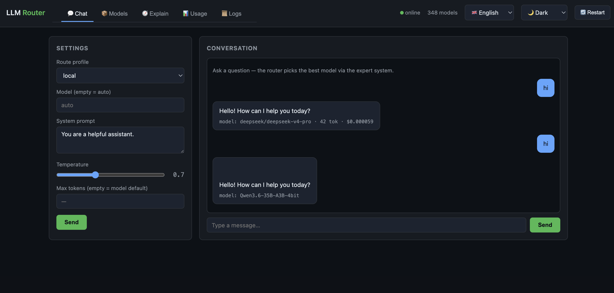

# router

A local proxy that speaks the OpenAI and Anthropic APIs and routes every request to the best available model via a deterministic expert system — no random sampling, no LLM-in-the-loop, no surprises.

**What it does**

- One endpoint for every model: point any OpenAI **or** Anthropic client at `http://127.0.0.1:4123` and send `"model": "auto"`.
- Picks the model per request from a weighted score over **cost, latency, context headroom, preference, and quality** — deterministic, same input → same choice.
- Per-request steering via a `x-route-profile` header (six built-in profiles) or a `privacy_tag` for "keep this local / ZDR-only".
- Falls back down the ranked list on upstream errors, streams SSE straight back to the caller.
- A native **[macOS menu-bar admin app](#admin-app-macos)** to edit the whole config and start/stop the router.
- A **[web interface](#web-interface)** at `http://127.0.0.1:4123` — chat playground, sortable model catalog, routing explain dry-run, usage dashboard and live loguru-style logs.

**Backends**: pluggable via the `Provider` trait. Built in:

- `openrouter` — cloud meta-provider, ~300 models with full pricing + provider routing
- `openai_compat` — any OpenAI-compatible server: [oMLX](https://omlx.ai/) / Ollama / LM Studio (local Apple Silicon), or OpenAI · Groq · DeepSeek · xAI · Mistral · Gemini (cloud)
- `anthropic` — native `/v1/messages` upstream (translated to/from OpenAI internally)

Any number of named backend instances can run at once; see [Configuration](#configuration).

## Get started

```bash
git clone https://github.com/deponere/llm-router.git
cd router
cp .env.example .env          # set OPENROUTER_API_KEY
cargo run -p router-api --release
```

Then point any OpenAI or Anthropic client at `http://127.0.0.1:4123`. See [Quick start](#quick-start) for a full request example.

## Learn more

- [How it works](#how-it-works) — the expert-system pipeline in four phases
- [Profiles](#profiles) — the six built-in routing profiles and their weights
- [Configuration](#configuration) — `config/router.toml` reference
- [Admin app (macOS)](#admin-app-macos) — edit config + control the router from the menu bar
- [Contributing](#contributing) — workspace layout, tests, and what has changed
- [CHANGELOG](./CHANGELOG.md) — release notes

## Reporting bugs

Open an issue on [github.com/deponere/llm-router/issues](https://github.com/deponere/llm-router/issues) with the request payload, the `x-route-profile` you used, and the log output from `RUST_LOG=router_core=debug`.

---

## How it works

```
Client (OpenAI or Anthropic format)
  │
  ▼
Ingress (Axum)              /v1/chat/completions  /v1/messages  /v1/models
  │
  ▼
Request Normalizer          unifies both API formats into NormRequest
  + Feature Detector        detects required caps: vision · tools · json · reasoning
  │
  ▼
Expert System               purely deterministic — fixed rule order
  Phase 1  profile resolve  x-route-profile header or route_profile body field
  Phase 2  hard filter      context window · modalities · caps · privacy · price · backend
  Phase 3  scoring          cost + latency + context headroom + preference + quality (configurable weights)
  Phase 4  provider flags   injects provider.* block for OpenRouter requests
  │
  ▼
Egress client (Provider)    streams SSE back; falls back down the ranked list on upstream errors
  ├── openrouter             cloud meta-provider with full provider routing control
  ├── openai_compat          any OpenAI-compatible server (oMLX / Ollama / OpenAI / Groq / …)
  └── anthropic              native /v1/messages, translated to/from OpenAI
```

The expert system never makes an LLM call to decide routing. Given an identical request and an identical model registry snapshot, it always picks the same model.

---

## Quick start

```bash
cp .env.example .env
# edit .env — set OPENROUTER_API_KEY (and optionally OMLX_HOST)

cargo run -p router-api

# in another terminal:
curl -s http://127.0.0.1:4123/v1/models | jq '.data | length'

curl -sN http://127.0.0.1:4123/v1/chat/completions \
  -H 'Content-Type: application/json' \
  -H 'x-route-profile: cheap' \
  -d '{"model":"auto","stream":true,"messages":[{"role":"user","content":"hi"}]}'
```

---

## Profiles

Select a profile via the `x-route-profile` header, the `route_profile` body field, or — for GUI clients that only expose a model dropdown — the synthetic `<profile>/auto` model id (e.g. `cheap/auto`). `/v1/models` advertises one per profile alongside plain `auto`.

| Profile | Intent | Key constraints |
|---------|--------|-----------------|
| `default` | balanced | cost 35 % · latency 25 % · context 15 % · preference 25 % |
| `cheap` | minimize cost | max $2/Mtok out · sort by price |
| `fast` | minimize latency | max 1 500 ms p95 · sort by latency |
| `private` | no data leaving controlled providers | ZDR or local only · `allow_fallbacks=false` |
| `smart` | best quality | Claude Opus / GPT-5 / Gemini 2.5 Pro · fp16/bf16/fp8 only |
| `local` | oMLX only | `backend_allowlist=["omlx"]` · zero cloud egress |

Weights, caps, and hard limits for each profile live in `config/router.toml`.

---

## Expert system — phases in order

### Phase 1 — profile resolution

`x-route-profile` header or `route_profile` body field → loads profile from `router.toml`. Falls back to `[profiles.default]`.

### Phase 2 — hard filters (first failure eliminates the candidate)

1. **Context window** — `prompt_tokens_est + max_tokens_reserve ≤ model.context_length`
2. **Modalities** — request modalities ⊆ model input modalities (e.g. image → vision model required)
3. **Capabilities** — tools / structured_outputs / reasoning must be in `model.supported_parameters`
4. **Privacy class** — profile may require `Local` or `Zdr`; `Standard` models are excluded
5. **Output price cap** — `profile.max_price_out_per_mtok` hard ceiling
6. **Backend allowlist** — profile may restrict to specific backend ids (e.g. `openrouter`, `omlx`)

### Phase 3 — scoring

```
score = w_cost    · cost_score      + w_latency · latency_score
      + w_context · context_score   + w_pref    · preference_score
      + w_quality · quality_score
```

Each sub-score is normalised to `[0, 1]` (`router-core/src/score.rs`):

| Sub-score | Formula | Horizon |
|-----------|---------|---------|
| `cost` | `1 − expected_cost_usd / 0.50` | > $0.50/request → 0 |
| `latency` | `1 − p95_ms / 5000` | > 5 s p95 → 0; unmeasured → 2500 ms (neutral) |
| `context` | `(context_length − prompt) / prompt` | more headroom → higher |
| `preference` | `1 − index/len` by position in `profile.preferences` | unlisted → 0 |
| `quality` | `intelligence_index / 100` (Artificial Analysis) | unrated → 0 (not a filter — see `min_intelligence_index`) |

Weights come from the active profile and are normalised to sum to 1. Tiebreak is fully deterministic: `(score desc, backend_priority asc, model_id asc)` — a local backend wins an exact tie, fixed by a unit test.

### Phase 4 — OpenRouter provider flags

For the winning OpenRouter candidate the `provider.*` block is injected:

- `require_parameters = true` — no silent parameter drops
- `sort` from profile (`"price"` / `"latency"` / `"throughput"`)
- `zdr = true` and `allow_fallbacks = false` in `private` profile
- `data_collection = "deny"` for ZDR/LocalOnly privacy tags
- `quantizations` restriction in `smart` profile (`["fp16","bf16","fp8"]`)

oMLX requests get the `provider` key stripped before forwarding.

---

## API endpoints

The proxy is a drop-in replacement for both OpenAI and Anthropic clients.

### OpenAI-compatible

```
GET  /v1/models                       merged model list (OpenRouter + oMLX)
POST /v1/chat/completions             stream or non-stream, auto routing
```

Extra fields accepted in the request body:

| Field | Type | Description |
|-------|------|-------------|
| `model` | `"auto"` or model id | `"auto"` triggers routing; an explicit id pins the model |
| `route_profile` | string | same as `x-route-profile` header |
| `privacy_tag` | `"normal"` \| `"zdr"` \| `"local_only"` | per-request privacy override |

### Anthropic-compatible

```
POST /v1/messages                     Anthropic Messages API (stream or non-stream)
```

Accepts the full Anthropic request format including `thinking`, tool use blocks, and image content. The proxy translates to OpenAI internally and translates the response back before returning.

### Observability

```
GET  /                          web interface (chat playground, model catalog, routing explain, usage, logs, settings)
GET  /v1/transactions?limit=N   recent calls + session/today totals
GET  /v1/stats?days=30          daily cost series from the SQLite history
GET  /v1/breakdown?by=backend   cost/calls grouped by backend|profile|model|key
GET  /v1/logs?limit=N           last log entries (in-memory ring buffer, loguru-structured)
POST /v1/logs/clear             clear the log ring buffer
GET  /v1/admin/config           current auth/storage/alerts settings
POST /v1/admin/config           update settings ({ "set": { "alerts.webhook_url": "…" } })
GET  /v1/admin/keys             configured API keys (masked hashes)
POST /v1/admin/keys             create a key (plaintext returned exactly once)
POST /v1/admin/keys/remove      delete a key
POST /v1/admin/alerts/test      fire a test alert
POST /v1/benchmark              parallel real calls to ≤3 models (TTFT/latency/tokens/cost)
POST /v1/admin/restart          restart the router process (same binary/args, new session; poll /healthz after)
```

Returns an in-memory ring buffer (last 100 calls) with per-call `duration_ms`, `tokens_out` and `cost_usd`, plus `totals_session` / `totals_today_utc` aggregates carrying `count`, `tokens_out` and `tokens_per_sec` (output tokens ÷ summed call duration). The [admin app](#admin-app-macos)'s **Log** tab renders this.

---

## Docker / docker compose

Der Router kann als Container laufen — `Dockerfile` (Multi-Stage, kompiliert SQLite
via `rusqlite bundled` mit, kein System-SQLite nötig) + `docker-compose.yml`:

```bash
docker compose up -d --build     # baut + startet auf Port 4123
docker compose logs -f router    # Logs (gleiches Format wie das Web-UI)
docker compose down              # stoppt; ./config (Config + SQLite) bleibt erhalten
docker compose up -d             # nach Config-Änderung in ./config/router.toml
```

**Container-Besonderheiten:**

- **Config + Historie bleiben persistent**: `./config` wird nach `/config` gemountet;
  `ROUTER_CONFIG=/config/router.toml` ist im Image gesetzt — die SQLite-Historie liegt
  dann in `./config/data/` auf dem Host.
- **Secrets**: `env_file: .env` reicht die Keys (`OPENROUTER_API_KEY`,
  `DEEPSEEK_API_KEY`, …) durch; `.env` ist im `.dockerignore` (kommt nie ins Image).
- **Key-Rotation**: Die macOS-Keychain existiert im Container nicht — stattdessen
  `OPENROUTER_MGMT_KEY` als Environment/Secret setzen (z. B. Docker-Secret-Datei).
  Ohne Management-Key loggt die Rotation nur eine Warnung und lässt den Request laufen.
- **oMLX (lokale Modelle)**: oMLX gibt es nur für macOS — ein lokales
  `[backends.omlx]` im Container braucht `base_url = "http://host.docker.internal:8008/v1"`,
  dann erreicht der Container das oMLX auf dem Mac-Host.
- **Ollama (Linux/macOS)**: `docker compose up` startet zusätzlich einen
  `ollama`-Service; die Container-Config `config/router.docker.toml` aktiviert
  `[backends.ollama]` (`http://ollama:11434/v1`) und das Profil `local` routet
  darauf. Geladene Modelle steuerst du per `OLLAMA_MODELS` (kommagetrennt,
  Default `qwen2.5:0.5b`); der Container lädt sie beim Start und hält sie via
  `OLLAMA_KEEP_ALIVE=-1` geladen. Weitere Modelle: `docker compose exec ollama
  ollama pull <modell>`. Hinweis: ohne GPU (z. B. OrbStack auf macOS) läuft die
  Generierung CPU-gebunden und träge — auf Linux mit NVIDIA-GPU die
  `deploy`-Sektion im compose einkommentieren, dann ist Ollama schnell.
- **Healthcheck**: `HEALTHCHECK` prüft `/healthz` alle 30 s; `restart: unless-stopped`
  zieht den Container bei Abstürzen wieder hoch. Der „Restart"-Button im Web-UI
  ersetzt den Prozess in-place (Container bleibt unverändert laufen).
- Non-root (UID 10001); Port `4123:4123` ist im compose gemappt.

## Configuration

`config/router.toml` is the single source of truth. Set `ROUTER_CONFIG` env var to override the path. It ships fully commented; the admin app (web settings tab / `router-admin`) edits it without clobbering those comments. No hot-reload — a restart re-reads it.

### Environment

### Backends

Any number of named instances. The table key (e.g. `omlx`) is the backend id and appears in `backend_allowlist`, routing traces, and metrics. `kind` picks the protocol: `openai_compat` · `openrouter` · `anthropic`. `local = true` marks a backend as privacy-class `Local` and wins score ties.

```toml
[backends.openrouter]
enabled  = true
kind     = "openrouter"
base_url = "https://openrouter.ai/api/v1"
auth     = { type = "api_key", env = "OPENROUTER_API_KEY" }

[backends.omlx]              # local Apple Silicon MLX server
enabled  = true
kind     = "openai_compat"
base_url = "http://127.0.0.1:8000/v1"
auth     = { type = "none" }
local    = true
```

`auth` is `{ type = "none" }` or `{ type = "api_key", env = "ENV_NAME" }`. Generic `openai_compat`/`anthropic` backends don't report prices (cost term = free); use `openrouter` for price-aware routing. Direct cloud providers (OpenAI, Anthropic, Gemini, Groq, DeepSeek, xAI, Mistral) ship pre-defined but disabled — flip `enabled` and export the key.

### Registry overrides

Patch modalities or capabilities that a backend's `/models` endpoint doesn't report:

```toml
[[registry.overrides]]
backend = "omlx"
id_prefix = "qwen3"
input_modalities = ["text"]
caps = ["tools"]
```

### Privacy classification

Maps OpenRouter provider slugs to privacy classes (unlisted → `Standard`):

```toml
[registry.privacy]
local = []
zdr   = ["anthropic", "openai", "google"]
```

### Quality scores (Artificial Analysis)

When enabled and `AA_API_KEY` is set, each model's Intelligence Index is pulled and feeds the `quality` score term (any profile with `weights.quality > 0`). Cached 24 h.

```toml
[registry.intelligence]
enabled     = true
api_key_env = "AA_API_KEY"
ttl_seconds = 86400

[registry.intelligence.aliases]   # map backend model id → AA slug
"Qwen3.6-35B-A3B-bf16" = "qwen3-6-35b-a3b"
```

### Custom profile

```toml
[profiles.my_profile]
weights = { cost = 0.6, latency = 0.2, context = 0.1, preference = 0.1 }
max_price_out_per_mtok = 5.0
backend_allowlist = ["omlx"]      # restrict to specific backends
model_denylist = ["*:free"]       # glob patterns against the full model id
provider_sort = "price"
```

---

## Admin app (macOS)

A native SwiftUI menu-bar app in [`macos-admin/`](./macos-admin/) edits the whole config and controls the router — no TOML by hand.

- **Backends** — toggle on/off, edit `kind` / `base_url` / `auth`, mark `local`; add or remove instances.
- **Profiles** — weight sliders (with a live Σ), price/latency caps, all allow/deny lists, provider flags.
- **Registry** — Intelligence config, privacy slugs, model overrides.
- **Router** — start / stop / restart, live status dot polling `/v1/models`.
- **Log** — live usage from `/v1/transactions`: session/today totals (call count, tokens/s, output tokens, cost) plus the last 50 calls with model, backend, profile, duration and tokens. The header also shows a compact `calls · tok/s · tokens · $` line.

Saving writes back through `router-admin` via `toml_edit`, so **comments and key order in `router.toml` survive** (a `.bak` is written first).

```bash
cd macos-admin
./build-app.sh          # builds the Rust helpers + RouterAdmin.app
open RouterAdmin.app     # icon appears in the menu bar
```

See [`macos-admin/README.md`](./macos-admin/README.md) for the architecture and a headless self-test.

---

## Web interface

A LightLLM-style single-file web UI, embedded in the router (no build step, no extra dependencies) at **`http://127.0.0.1:4123/`** (also `/ui`). It speaks the router's own JSON endpoints.



- **Chat** — playground with profile/model controls (system prompt, temperature, max tokens) and SSE streaming; every answer shows the routed model, tokens and cost, plus a collapsible routing trace (winner, ranking, rejected candidates).
- **Models** — the full registry: context, in/out pricing, measured p95, AA Intelligence Index, modalities, capabilities, privacy class — sortable by column, filterable live.
- **Explain** — dry-run of the expert system on any request body: winner, active weights, scored ranking and every rejected candidate with its reason.
- **Logs** — live view of the router's in-memory log buffer (last 500 entries, polled every 1.5 s), rendered loguru-style: `ts | LEVEL | target:line - message` with level colors, level filter, search, pause, clear and copy-as-text.
- **Usage** — session/today KPIs plus a persistent cost history (SQLite): daily cost chart (7/30/90 days) and breakdowns by backend / profile / model / API key.
- **Benchmark** — in the Explain tab: „Benchmark top 3" runs real parallel calls against the top-ranked candidates and compares TTFT, total latency, tokens and cost.
- **Settings** — edit API keys + budgets, storage and alert settings in the browser (comment-preserving writes, save → auto-restart), plus `router-admin auth add|list|rm` and `alerts test` on the CLI. A key can be **pinned to a profile** (`profile = "…"` / `--profile <name>`): the server then forces that profile on every request under the key and ignores `x-route-profile`/`route_profile`/`<profile>/auto` — pin a key to a `backend_allowlist`-restricted profile (e.g. `["omlx"]`) and it cannot reach cloud backends.
- **Theme** — dark / light / system switcher in the header (persisted in `localStorage`, no flash on load; `system` follows the OS appearance, including the log level colors).
- **Language** — English (default), Deutsch, Español, Français — switchable in the header and persisted; number/date formatting follows the locale, default field values (system prompt, explain sample) translate too.
- **Restart** — `🔄 Neu starten` in the header calls `POST /v1/admin/restart` and reloads once the router is back.

---

## Environment variables

| Variable | Required | Default | Description |
|----------|----------|---------|-------------|
| `OPENROUTER_API_KEY` | if OpenRouter enabled | — | OpenRouter API key |
| `OMLX_HOST` | no | `http://127.0.0.1:8000` | oMLX server base URL |
| `OMLX_API_KEY` | no | — | oMLX auth token (if configured) |
| `AA_API_KEY` | if `[registry.intelligence]` enabled | — | Artificial Analysis key for quality scores |
| `ROUTER_CONFIG` | no | `config/router.toml` | path to config file |
| `ROUTER_BIND` | no | from config `server.bind` | override listen address, e.g. `0.0.0.0:4123` in Docker |
| `OPENROUTER_MGMT_KEY` | no | — | rotation management key (container/CI fallback; macOS uses the Keychain instead) |
| `RUST_LOG` | no | `info` | tracing filter (e.g. `router_core=debug`) |

Env vars are loaded from `.env` (via `dotenvy`) at the working directory.

---

## OpenRouter key rotation

The router rotates the OpenRouter inference key **automatically, in-process** — no cron, no external scheduler. On every request (`/v1/chat/completions`, `/v1/messages`, `/v1/models`) it checks — throttled to a real check every 30 s — whether the process has been running longer than `OPENROUTER_ROTATE_DAYS` **or** the current key is older than that (tracked via `OPENROUTER_LAST_ROTATION` in `.env`; an unset entry counts as stale). When due, it creates a new key via the [Management API Keys](https://openrouter.ai/docs/guides/overview/auth/management-api-keys) API, verifies it, activates it (process env + `.env`), then deletes the previous key. One rotation at a time; failures are logged and retried on the next check — requests are never blocked.

**Setup (one-time):**

1. Create a Management API key: openrouter.ai → *Management API Keys* → *Create New Key*. It cannot make inference calls — admin only.
2. Store it in the macOS Keychain: `./scripts/store-key.sh` (reads the key via `read -s`; it never lands in shell history or a file).
3. Configure in `.env` (template in [.env.example](./.env.example)):
   - `OPENROUTER_LIMIT` — USD limit per key (without it the key is created unlimited)
   - `OPENROUTER_LIMIT_RESET` — `daily` | `weekly` | `monthly` budget reset (best-effort)
   - `OPENROUTER_ROTATE_DAYS` — rotation interval (default 10)
   - `OPENROUTER_MGMT_KEY_SERVICE` — keychain service name (default `openrouter-management-key`)

The new key string is only ever written into `.env`, never logged. The router reads `.env` at startup, so the rotation state (`OPENROUTER_LAST_ROTATION`, `OPENROUTER_KEY_HASH`) survives restarts.

`scripts/rotate-openrouter-key.sh` remains as an optional manual tool (`--force` / `--status` / `--dry-run`) if you ever want to rotate ahead of schedule.

---

## Workspace layout

```
crates/
├── router-config/      TOML loader — Config, Profile, Weights
├── router-core/        expert system — norm · registry · rules · score · decision
├── router-providers/   egress clients — Provider trait · OpenRouter · openai_compat · Anthropic · LatencyTracker · AA
├── router-api/         Axum server — OpenAI + Anthropic handlers · routes · fallback
└── router-admin/       dump/apply JSON bridge for the admin app (comment-preserving toml_edit)
macos-admin/            SwiftUI menu-bar admin app
config/
└── router.toml         profiles, backends, registry overrides
.env.example            env var template
```

---

## Development

```bash
# run all tests (unit + integration with wiremock)
cargo test

# run only the core expert-system tests (no network)
cargo test -p router-core

# run E2E tests with mocked OpenRouter
cargo test -p router-api --test e2e_openrouter

# release build
cargo build --release

# live log of routing decisions
RUST_LOG=info,router_core=debug cargo run -p router-api
```

The model registry is cached for 5 minutes (moka TTL). A restart forces a fresh fetch.

> **macOS note:** if `cargo build` fails at the link step with `unknown command '…symbols.o'`, a Homebrew `cc` shim is shadowing Apple's compiler. The committed `.cargo/config.toml` pins the real `/usr/bin/cc`; keep it.

---

## Contributing

A Cargo workspace ([layout above](#workspace-layout)) plus a Swift package under `macos-admin/`. To contribute:

1. `cargo test --workspace` must stay green; add a test for any routing-logic change (the expert-system phases are unit-tested in `router-core`).
2. Keep the expert system **deterministic** — no clocks, randomness, or network in scoring/filtering.
3. Conventional Commits (`feat:` / `fix:` / `chore:` / `refactor:` / `docs:`).
4. New backend? Implement the `Provider` trait in `router-providers` and add a `kind` to `router-config`.

### What's changed since 0.1.0

- **Arbitrary backends** via a `Provider` trait — `openai_compat` and native `anthropic` upstreams alongside OpenRouter.
- **Secret-Guard (DLP)** — secrets detected in a prompt (API-token prefixes, PEM private keys incl. SPIFFE-SVID keys, credit cards via Luhn, IBAN via mod-97, and unknown high-entropy tokens) force local-only routing, so the secret never leaves the machine.
- **Key→profile pinning** — a router API key can be pinned to a profile the server enforces on every request (ignores `x-route-profile`/`route_profile`/`<profile>/auto`).
- **Quality scoring** — Artificial Analysis Intelligence Index as a fifth score term (`weights.quality`) + `min_intelligence_index` hard filter.
- **Fallback cascade** — on an upstream 4xx/5xx the router walks down the ranked candidates instead of returning the error.
- **macOS admin app** + `router-admin` comment-preserving config bridge.
- **Web interface** — chat playground with SSE streaming, sortable model catalog, routing explain dry-run, usage dashboard and live loguru-style logs (`GET /`).
- **Automatic key rotation** — in-process OpenRouter key rotation via the Management API (macOS Keychain-stored management key, `OPENROUTER_LIMIT`/`OPENROUTER_ROTATE_DAYS` in `.env`), plus `POST /v1/admin/restart` and `GET /v1/logs`.
- API fixes — spec-compliant Anthropic stream close, honour `stream: false`, aggregate `tool_calls`/usage; case-insensitive oMLX override matching; `:free` denied by default.
- Dependency + lint cleanup (dropped `tiktoken-rs`, `async-trait` where unused, `tower`, `tokio-stream`); removed the old xbar widget in favour of the admin app.

Full list in [CHANGELOG](./CHANGELOG.md).

---

## Latency tracking

Every successful completion records the time-to-first-token. The `LatencyTracker` keeps a per-model ring buffer (last 200 samples) and exposes p50 and p95 percentiles. These feed directly into the `latency_score` in Phase 3. Before enough samples accumulate the score falls back to zero (unknown latency → neutral, not penalised).

---

## Limitations / non-goals (v0.1)

- No persistent metrics — latency data resets on restart.
- No hot-reload — config changes require a restart (the admin app has a restart button).
- Claude Max excluded — Anthropic's April 2026 ToS prohibits third-party proxying of Max subscriptions.

---

## License

Released under the [MIT License](./LICENSE).

Copyright © 2026 Markus & Alex.
